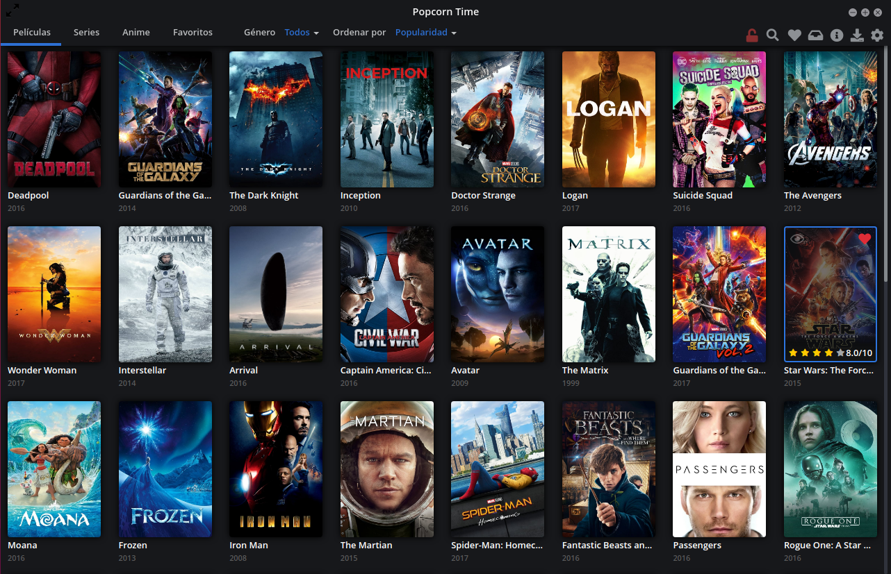
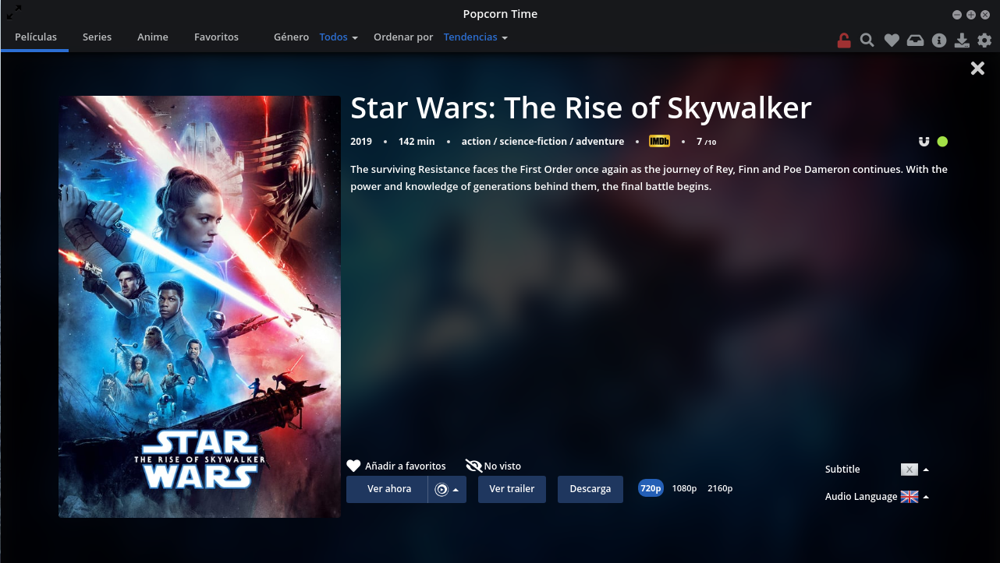

## Descripción de la prueba

Tomando como base la API de ["The Movie DB"](https://developers.themoviedb.org/3/getting-started/introduction) se requiere crear un clon de la pantalla principal y detallada de la aplicación "Popcorn Time"

### Requerimientos:

- La maquetación del sitio se debe realizar sin utilizar librerías externas.
- No es necesario realizar animaciones ni menús desplegables, solamente se requiere la vista de grilla y uno que otro botón que demuestre el buen uso de CSS
- Las opciones que se muestran en los menús no deben funcionar y solo se deben mostrar para imitar la interfaz de la aplicación.
- Se debe poder filtrar las películas por nombre. Esto se puede hacer desde un input ubicado posterior al menú
- No se requiere métodos de autenticación para ingresar a la aplicación.
- Hacer buen uso de GIT/GitFlow. No encapsular todo en un único commit.

### Puntos extra si:

- Maquetas haciendo uso de flex grids
- Haces uso de un framework de pruebas (Jest, Cypress, otros)
- Subes el sitio a algún proveedor de hosting (surge.sh, heroku, otros)
- Creas el archivo docker/docker compose para facilitar el despliegue
- Simulas el CI/CD haciendo uso de algún proveedor (Jenkins, CircleCI, otros)
- Muchos puntos extra si: creas la infraestructura en AWS o GCP (de forma manual o automatizada)

No hay límite de tiempo para entregar la prueba, pero es importante demostrar el progreso realizado con los commit de GIT.
